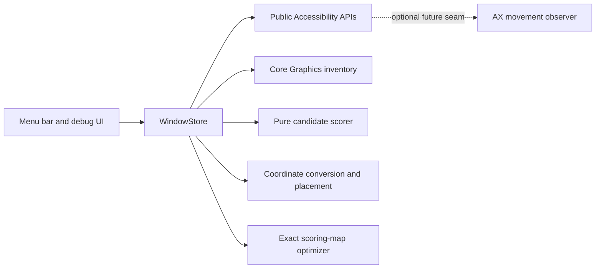

# Architecture

AX windows are correlated to window-server metadata conservatively by PID and geometry. `CGWindowListCopyWindowInfo` provides metadata, but no guaranteed stable AX identity; ambiguous matches deliberately report no layer.

Placement is not restricted to corners. Summed-area tables evaluate every pixel-aligned map position and search video sizes from largest to smallest, subject to aspect ratio, bounds, a mean-cost budget, and a strict limit on the fraction of high-importance pixels covered. The optimizer therefore shrinks the video when a larger rectangle would obscure salient content. Area is primary only among rectangles that pass both safety gates; map cost and deterministic top/left ordering break ties.

Phase 2 takes a user-triggered ScreenCaptureKit screenshot, excluding ScootPiP and the selected PiP window. A pure map generator weights edges, luminance, saturation, and centrality; menu-bar and Dock regions receive maximum cost. The UI previews the heatmap and exact rectangle before a separate user action moves the window.

For interactive performance, image analysis is capped at a 320-cell-wide aspect-preserving saliency grid. Summed-area tables then evaluate each candidate rectangle in constant time and map the result back to global screen points. Core Graphics inventory order supplies an additional front-to-back prior: up to four compact foreground windows receive decreasing protection, while windows covering at least 90% of the display are not given this extra penalty.

Refresh automatically selects windows whose normalized AX title explicitly contains “Picture in Picture” (including hyphenated variants). If multiple browsers expose PiP windows, candidate score and stable ID provide deterministic ordering. Geometry-only detection remains manual to prevent moving unrelated palettes.
