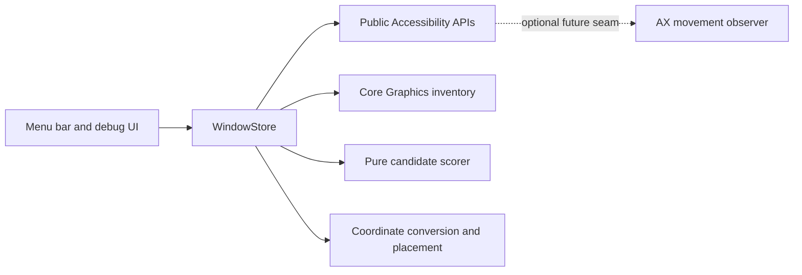

# Architecture

AX windows are correlated to window-server metadata conservatively by PID and geometry. `CGWindowListCopyWindowInfo` provides metadata, but no guaranteed stable AX identity; ambiguous matches deliberately report no layer.

